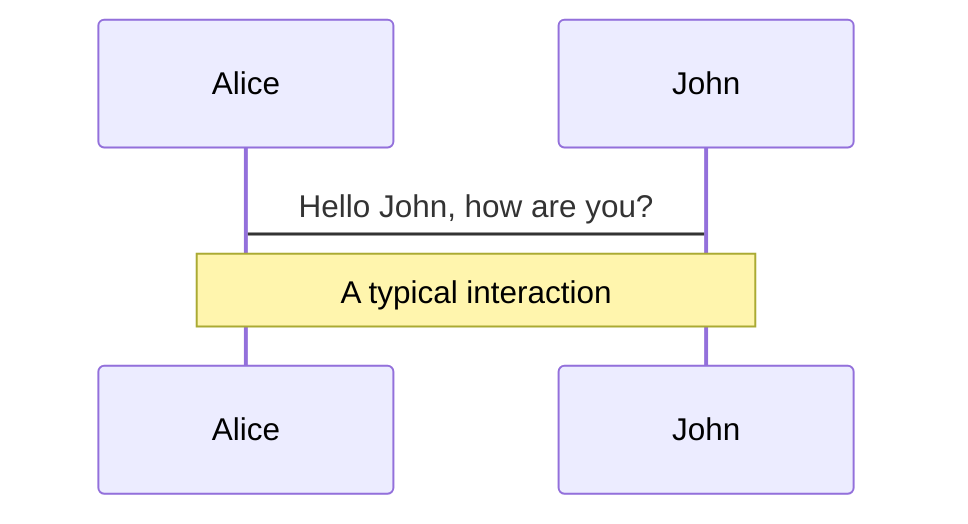
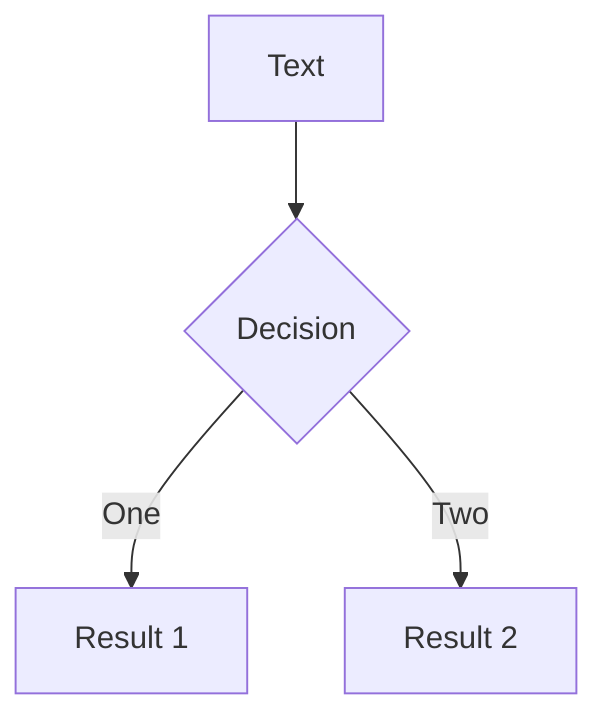
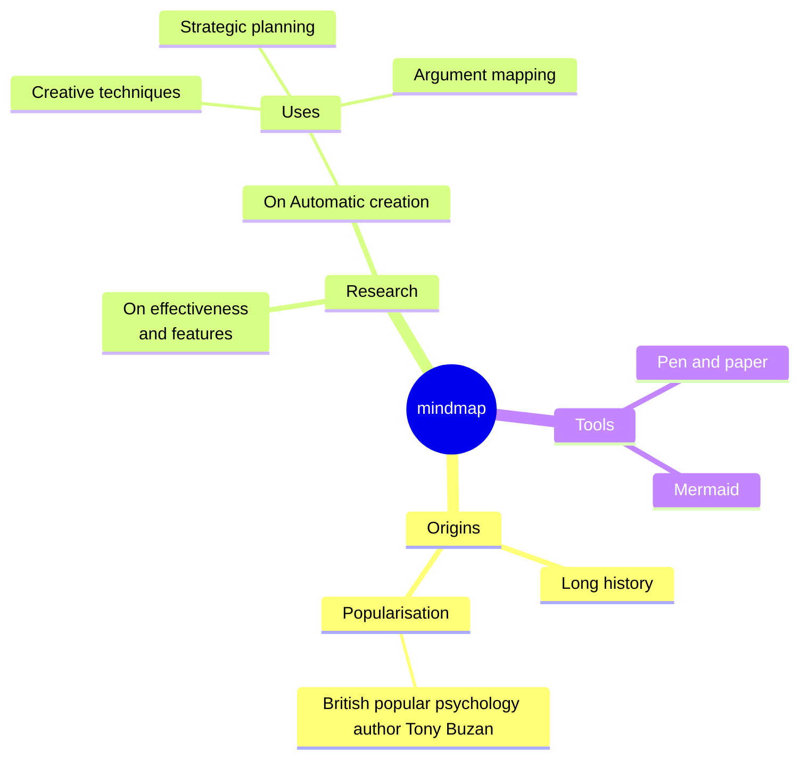
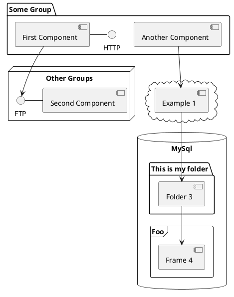

---
# try also 'default' to start simple
theme: seriph
# random image from a curated Unsplash collection by Anthony
# like them? see https://unsplash.com/collections/94734566/slidev
background: https://cover.sli.dev
# some information about your slides (markdown enabled)
title: MicroGPT
info: |
  ## Making your own generator from scratch
  And understanding the logic behind it
# apply UnoCSS classes to the current slide
class: text-center
# slide transition: https://sli.dev/guide/animations.html#slide-transitions
transition: slide-up
# enable Comark Syntax: https://comark.dev/syntax/markdown
comark: true
# duration of the presentation
duration: 35min
---

# What is a GPT?

Making your own generator from scratch

And understanding the logic behind it

<!--
Introduction
-->

---
transition: slide-up
---

# Setup

- **New Project** - Create a new project in your favorite language
- **Data** - Download tropico_species.txt

<br>
..
<br>
That's it

<!--
Here is another comment.
-->

---
transition: slide-up
level: 2
class: bg-[#e8e4df]
---

# Program Elements

<div class="flex justify-center mt-10">
<table class="program-elements-table">
  <tr v-click="1">
    <td class="font-bold w-40">Tokenizer</td>
    <td>Translates strings into integers</td>
  </tr>
  <tr v-click="2">
    <td class="font-bold w-40">Value Nodes</td>
    <td>Stores our value, gradient and structure</td>
  </tr>
  <tr v-click="3">
    <td class="font-bold w-40">Configuration</td>
    <td>Stores our parameters</td>
  </tr>
  <tr v-click="4">
    <td class="font-bold w-40">Helper Functions</td>
    <td>Linear mapping, softmax, normalization</td>
  </tr>
  <tr v-click="5">
    <td class="font-bold w-40">GPT Algorithm</td>
    <td>Attention, Backpropagation</td>
  </tr>
  <tr v-click="6">
    <td class="font-bold w-40">Optimizer</td>
    <td>Learning rate, Parameter updates</td>
  </tr>
</table>
</div>

<!-- Extra click to show final state -->
<div v-click="7" class="hidden"></div>

<style>
.program-elements-table {
  width: 80%;
  border-spacing: 0 0.5rem;
  border-collapse: separate;
}

.program-elements-table td {
  padding: 0.75rem 1rem;
}

.program-elements-table tr {
  transition: all 0.4s ease-in-out;
  color: #555;
}

/* Active row style: White background, black text, 120% scale */
.program-elements-table tr.slidev-vclick-current {
  background-color: white !important;
  color: black !important;
  transform: scale(1.2);
  z-index: 10;
  position: relative;
  box-shadow: 0 10px 15px -3px rgba(0, 0, 0, 0.1);
}

/* Past row style: No background, faded text, 100% scale */
.program-elements-table tr.slidev-vclick-visible:not(.slidev-vclick-current) {
  background-color: transparent !important;
  color: #666 !important;
  opacity: 0.8;
  transform: scale(1);
}

/*
  FINAL STATE (Click 7):
  Targeting the state where all rows are visible but no longer current.
*/
.slidev-page-3.slidev-clicks-7 .program-elements-table tr {
  opacity: 1 !important;
  color: #333 !important;
  transform: scale(1) !important;
  background-color: transparent !important;
  box-shadow: none !important;
}

/* Initial state: Hidden before click */
.program-elements-table tr.slidev-vclick-hidden {
  opacity: 0;
  transform: translateY(10px);
}
</style>

---
layout: two-cols
layoutClass: gap-16 grid-cols-[2fr_3fr]
---

# Tokenizer

GPT is a matrix algebra system. It uses numbers, not strings. How do we get to those numbers?

- **Granularity**: We can tokenize by word, sub-word, or character.
- **Special Tokens**: We add markers like `BOS` to help the model identify boundaries.
- **Mapping**: Each unique token is assigned a unique integer ID.

::right::
<div class="flex flex-col h-full mt-4 pr-4 transition-all duration-800">
  <!-- Token Row -->
  <div class="token-container flex flex-nowrap justify-center items-center font-mono mt-10">
    <div v-click="2" class="token-box token-special bg-emerald-600 text-white border-emerald-700 mr-2">BOS</div>
    <div v-for="(char, i) in 'Agave'.split('')" :key="i" class="token-box transition-all duration-800 ease-in-out text-4xl" :class="$clicks >= 1 ? 'border-gray-400 bg-white shadow-sm mx-1' : 'border-transparent -mx-1.5'">{{ char }}</div>
    <div v-click="2" class="token-box token-special bg-emerald-600 text-white border-emerald-700 ml-2">BOS</div>
  </div>

  <!-- Arrow -->
  <div v-click="3" class="flex justify-center my-4">
    <div class="text-3xl text-blue-600 transition-all duration-800">↓</div>
  </div>

  <!-- ID Row -->
  <div v-click="3" class="token-container flex flex-nowrap justify-center items-center font-mono transition-all duration-800">
    <div class="token-box token-special border-emerald-700 bg-emerald-50 text-emerald-700 mr-2">56</div>
    <div v-for="(id, i) in [27, 7, 1, 22, 5]" :key="i" class="token-box border-gray-400 bg-gray-50 shadow-sm mx-1 text-2xl text-gray-600">{{ id }}</div>
    <div class="token-box token-special border-emerald-700 bg-emerald-50 text-emerald-700 ml-2">56</div>
  </div>

  <div class="mt-auto mb-16 text-center min-h-[6rem] relative transition-all duration-800">
    <!-- Steps 1 & 2 -->
    <div class="transition-all duration-800 absolute inset-x-0 top-0" :class="$clicks < 3 ? 'opacity-100' : 'opacity-0 pointer-events-none'">
      <v-click at="1"><p class="text-sm italic text-gray-500">Each character becomes a discrete unit...</p></v-click>
      <v-click at="2"><p class="text-sm italic text-emerald-600 font-bold">...and we wrap the sequence in special tokens.</p></v-click>
    </div>
    <!-- Step 3 -->
    <div class="transition-all duration-800 absolute inset-x-0 top-0" :class="$clicks == 3 ? 'opacity-100' : 'opacity-0 pointer-events-none'">
      <p class="text-sm italic text-blue-600 font-bold">Finally, we map each unique token to a unique integer ID.</p>
    </div>
    <!-- Step 4: Final Punch -->
    <div class="transition-all duration-800 absolute inset-x-0 top-0" :class="$clicks >= 4 ? 'opacity-100' : 'opacity-0 pointer-events-none'">
      <p class="text-lg font-bold text-orange-600">Now go ahead and implement your tokenizer.</p>
      <p class="text-sm italic text-gray-600">Run it on the whole dataset to make sure you're not missing tokens.</p>
    </div>
  </div>
</div>

<!-- Ensure click 4 exists -->
<div v-click="4" class="hidden"></div>

<style>
.token-box {
  min-width: 3rem;
  height: 3.5rem;
  display: flex;
  align-items: center;
  justify-content: center;
  border-width: 2px;
  border-style: solid;
  border-radius: 0.5rem;
  flex-shrink: 0;
}
.token-special {
  min-width: 2.5rem;
  height: 2.5rem;
  font-size: 0.875rem;
}
</style>


---
layout: default
class: p-0
---

<div class="grid grid-cols-[65fr_35fr] h-full w-full">
  <div class="p-12 pr-8">
    <h1 class="text-4xl mb-8">Implementation</h1>

```python {all|2-4|7-9|all}
# 1. Load and Shuffle
docs = [l.strip() for l in open('species.txt') if l.strip()]
random.shuffle(docs)

# 2. Build Vocabulary
uchars = sorted(set(''.join(docs)))
BOS = len(uchars)
vocab_size = len(uchars) + 1

print(f"Vocab size: {vocab_size}")
# Result: 55 unique chars + 1 BOS = 56
```

  </div>
  <div
    class="h-full w-full bg-cover bg-center"
    style="background-image: url('https://cover.sli.dev')"
  >
  </div>
</div>

---

# The Objective

We want our model to learn one thing: **Predict the next token.**

<div class="flex flex-col items-center justify-center h-full mt-[-8rem] space-y-4">
  
  <!-- Step 1: Predict 'A' -->
  <div class="flex flex-col items-center scale-90">
    <div class="token-container flex flex-nowrap justify-center items-center font-mono opacity-20 transition-opacity duration-500" :class="$clicks >= 1 ? 'opacity-100' : ''">
      <div class="token-box token-special bg-emerald-600 text-white border-emerald-700 mr-2" :class="$clicks == 1 ? 'ring-4 ring-blue-400 shadow-lg' : ($clicks > 1 ? 'opacity-50' : '')">BOS</div>
      <div class="token-box border-gray-400 bg-white shadow-sm mx-1 text-4xl" :class="$clicks >= 2 ? 'ring-4 ring-orange-500 scale-110 opacity-100' : ''">A</div>
      <div class="token-box border-gray-400 bg-white shadow-sm mx-1 text-4xl opacity-30">g</div>
      <div class="token-box border-gray-400 bg-white shadow-sm mx-1 text-4xl opacity-30">a</div>
      <div class="token-box border-gray-400 bg-white shadow-sm mx-1 text-4xl opacity-30">v</div>
      <div class="token-box border-gray-400 bg-white shadow-sm mx-1 text-4xl opacity-30">e</div>
      <div class="token-box token-special bg-emerald-600 text-white border-emerald-700 ml-2 opacity-30">BOS</div>
    </div>
    <div class="h-6 mt-1 text-xs font-bold uppercase tracking-widest">
      <span v-if="$clicks == 1" class="text-blue-600">Input: [BOS]</span>
      <span v-if="$clicks >= 2" class="text-orange-600">Target: A</span>
    </div>
  </div>

  <!-- Step 2: Predict 'g' -->
  <div v-click="3" class="flex flex-col items-center scale-90">
    <div class="token-container flex flex-nowrap justify-center items-center font-mono transition-opacity duration-500" :class="$clicks >= 3 ? 'opacity-100' : 'opacity-10'">
      <div class="token-box token-special bg-emerald-600 text-white border-emerald-700 mr-2" :class="$clicks >= 3 ? 'ring-4 ring-blue-400 opacity-100' : ''">BOS</div>
      <div class="token-box border-gray-400 bg-white shadow-sm mx-1 text-4xl" :class="$clicks >= 3 ? 'ring-4 ring-blue-400 opacity-100' : ''">A</div>
      <div class="token-box border-gray-400 bg-white shadow-sm mx-1 text-4xl" :class="$clicks >= 4 ? 'ring-4 ring-orange-500 scale-110 opacity-100' : 'opacity-30'">g</div>
      <div class="token-box border-gray-400 bg-white shadow-sm mx-1 text-4xl opacity-30">a</div>
      <div class="token-box border-gray-400 bg-white shadow-sm mx-1 text-4xl opacity-30">v</div>
      <div class="token-box border-gray-400 bg-white shadow-sm mx-1 text-4xl opacity-30">e</div>
      <div class="token-box token-special bg-emerald-600 text-white border-emerald-700 ml-2 opacity-30">BOS</div>
    </div>
    <div class="h-6 mt-1 text-xs font-bold uppercase tracking-widest">
      <span v-if="$clicks == 3" class="text-blue-600">Input: [BOS, A]</span>
      <span v-if="$clicks >= 4" class="text-orange-600">Target: g</span>
    </div>
  </div>

  <!-- Step 3: Predict 'a' -->
  <div v-click="5" class="flex flex-col items-center scale-90">
    <div class="token-container flex flex-nowrap justify-center items-center font-mono transition-opacity duration-500" :class="$clicks >= 5 ? 'opacity-100' : 'opacity-10'">
      <div class="token-box token-special bg-emerald-600 text-white border-emerald-700 mr-2" :class="$clicks >= 5 ? 'ring-4 ring-blue-400 opacity-100' : ''">BOS</div>
      <div class="token-box border-gray-400 bg-white shadow-sm mx-1 text-4xl" :class="$clicks >= 5 ? 'ring-4 ring-blue-400 opacity-100' : ''">A</div>
      <div class="token-box border-gray-400 bg-white shadow-sm mx-1 text-4xl" :class="$clicks >= 5 ? 'ring-4 ring-blue-400 opacity-100' : ''">g</div>
      <div class="token-box border-gray-400 bg-white shadow-sm mx-1 text-4xl" :class="$clicks >= 6 ? 'ring-4 ring-orange-500 scale-110 opacity-100' : 'opacity-30'">a</div>
      <div class="token-box border-gray-400 bg-white shadow-sm mx-1 text-4xl opacity-30">v</div>
      <div class="token-box border-gray-400 bg-white shadow-sm mx-1 text-4xl opacity-30">e</div>
      <div class="token-box token-special bg-emerald-600 text-white border-emerald-700 ml-2 opacity-30">BOS</div>
    </div>
    <div class="h-6 mt-1 text-xs font-bold uppercase tracking-widest">
      <span v-if="$clicks == 5" class="text-blue-600">Input: [BOS, A, g]</span>
      <span v-if="$clicks >= 6" class="text-orange-600">Target: a</span>
    </div>
  </div>

</div>

<style>
.token-box {
  min-width: 2.8rem;
  height: 3.2rem;
  display: flex;
  align-items: center;
  justify-content: center;
  border-width: 2px;
  border-style: solid;
  border-radius: 0.5rem;
  flex-shrink: 0;
  transition: all 0.4s ease;
}
.token-special {
  min-width: 2.5rem;
  height: 2.5rem;
  font-size: 0.75rem;
}
</style>

<style>
.token-box {
  min-width: 3.5rem;
  height: 4rem;
  display: flex;
  align-items: center;
  justify-content: center;
  border-width: 2px;
  border-style: solid;
  border-radius: 0.5rem;
  flex-shrink: 0;
  transition: all 0.4s ease;
}
.token-special {
  min-width: 3rem;
  height: 3rem;
  font-size: 0.875rem;
}
</style>

---
layout: two-cols
layoutClass: gap-12
---

# The `Value` Node
The fundamental atom of our autograd engine.

```python {all|2|4-8|all}
class Value:
    __slots__ = ('data', 'grad', '_children', '_local_grads')

    def __init__(self, data, children=(), local_grads=()):
        self.data = data           # The actual value (e.g. 0.5)
        self.grad = 0              # dLoss / dNode
        self._children = children  # Pointers to inputs
        self._local_grads = local_grads # Local partials
```

::right::

<div class="flex flex-col items-center justify-center h-full">
  <div class="text-center mb-4 relative">
    <p class="text-sm font-bold text-gray-400 uppercase tracking-widest mb-10">Conceptual Anatomy</p>
    <div class="absolute left-[-60px] top-[60%] flex items-center">
      <div class="w-12 h-0.5 border-t-2 border-dashed border-gray-400"></div>
      <div class="w-0 h-0 border-y-4 border-y-transparent border-l-8 border-l-gray-400"></div>
      <span class="absolute -top-6 left-0 text-[10px] font-bold text-gray-400 uppercase tracking-tighter">_children</span>
    </div>
    <div class="relative w-56 h-56 rounded-full border-4 border-gray-300 shadow-xl overflow-hidden flex flex-col">
      <div class="h-1/2 bg-emerald-50 flex items-center justify-center border-b-2 border-gray-300">
        <div class="text-2xl font-mono font-bold text-emerald-800">data</div>
      </div>
      <div class="h-1/2 bg-orange-50 flex items-center justify-center">
        <div class="text-2xl font-mono font-bold text-orange-600">grad</div>
      </div>
      <div class="absolute left-0 top-1/2 -translate-y-1/2 bg-gray-300 w-3 h-10 rounded-r-lg"></div>
    </div>
  </div>
  <div class="w-full px-12 mt-4">
    <v-click>
      <div class="flex items-center h-2 gap-3 mb-1">
        <div class="w-2.5 h-2.5 rounded-full bg-emerald-500 shrink-0"></div>
        <p class="text-sm m-0"><strong>Data:</strong> State during the <em>forward pass</em>.</p>
      </div>
    </v-click>
    <v-click>
      <div class="flex items-center h-2 gap-3 mb-1 mt-8">
        <div class="w-2.5 h-2.5 rounded-full bg-orange-500 shrink-0"></div>
        <p class="text-sm m-0"><strong>Grad:</strong> Accumulated Gradient from the <em>backward pass</em>.</p>
      </div>
    </v-click>
    <v-click>
      <div class="flex items-center h-2 gap-3 mt-8">
        <div class="w-2.5 h-2.5 rounded-full bg-gray-400 shrink-0"></div>
        <p class="text-sm m-0"><strong>Children:</strong> Input nodes in the graph.</p>
      </div>
    </v-click>
  </div>
</div>

---

# Components

<div grid="~ cols-2 gap-4">
<div>

You can use Vue components directly inside your slides.

We have provided a few built-in components like `<Tweet/>` and `<Youtube/>` that you can use directly. And adding your custom components is also super easy.

```html
<Counter :count="10" />
```

<!-- ./components/Counter.vue -->
<Counter :count="10" m="t-4" />

Check out [the guides](https://sli.dev/builtin/components.html) for more.

</div>
<div>

```html
<Tweet id="1390115482657726468" />
```

<Tweet id="1390115482657726468" scale="0.65" />

</div>
</div>

<!--
Presenter note with **bold**, *italic*, and ~~striked~~ text.

Also, HTML elements are valid:
<div class="flex w-full">
  <span style="flex-grow: 1;">Left content</span>
  <span>Right content</span>
</div>
-->

---
class: px-20
---

# Themes

Slidev comes with powerful theming support. Themes can provide styles, layouts, components, or even configurations for tools. Switching between themes by just **one edit** in your frontmatter:

<div grid="~ cols-2 gap-2" m="t-2">

```yaml
---
theme: default
---
```

```yaml
---
theme: seriph
---
```


</div>

Read more about [How to use a theme](https://sli.dev/guide/theme-addon#use-theme) and
check out the [Awesome Themes Gallery](https://sli.dev/resources/theme-gallery).

---

# Clicks Animations

You can add `v-click` to elements to add a click animation.

<div v-click>

This shows up when you click the slide:

```html
<div v-click>This shows up when you click the slide.</div>
```

</div>

<br>

<v-click>

The <span v-mark.red="3"><code>v-mark</code> directive</span>
also allows you to add
<span v-mark.circle.orange="4">inline marks</span>
, powered by [Rough Notation](https://roughnotation.com/):

```html
<span v-mark.underline.orange>inline markers</span>
```

</v-click>

<div mt-20 v-click>

[Learn more](https://sli.dev/guide/animations#click-animation)

</div>

---

# Motions

Motion animations are powered by [@vueuse/motion](https://motion.vueuse.org/), triggered by `v-motion` directive.

```html
<div
  v-motion
  :initial="{ x: -80 }"
  :enter="{ x: 0 }"
  :click-3="{ x: 80 }"
  :leave="{ x: 1000 }"
>
  Slidev
</div>
```

<div class="w-60 relative">
  <div class="relative w-40 h-40">
    
    
    
  </div>

  <div
    class="text-5xl absolute top-14 left-40 text-[#2B90B6] -z-1"
    v-motion
    :initial="{ x: -80, opacity: 0}"
    :enter="{ x: 0, opacity: 1, transition: { delay: 2000, duration: 1000 } }">
    Slidev
  </div>
</div>

<!-- vue script setup scripts can be directly used in markdown, and will only affects current page -->
<script setup lang="ts">
const final = {
  x: 0,
  y: 0,
  rotate: 0,
  scale: 1,
  transition: {
    type: 'spring',
    damping: 10,
    stiffness: 20,
    mass: 2
  }
}
</script>

<div
  v-motion
  :initial="{ x:35, y: 30, opacity: 0}"
  :enter="{ y: 0, opacity: 1, transition: { delay: 3500 } }">

[Learn more](https://sli.dev/guide/animations.html#motion)

</div>

---

# $\LaTeX$

$\LaTeX$ is supported out-of-box. Powered by [$\KaTeX$](https://katex.org/).

<div h-3 />

Inline $\sqrt{3x-1}+(1+x)^2$

Block
$$ {1|3|all}
\begin{aligned}
\nabla \cdot \vec{E} &= \frac{\rho}{\varepsilon_0} \\
\nabla \cdot \vec{B} &= 0 \\
\nabla \times \vec{E} &= -\frac{\partial\vec{B}}{\partial t} \\
\nabla \times \vec{B} &= \mu_0\vec{J} + \mu_0\varepsilon_0\frac{\partial\vec{E}}{\partial t}
\end{aligned}
$$

[Learn more](https://sli.dev/features/latex)

---

# Diagrams

You can create diagrams / graphs from textual descriptions, directly in your Markdown.

<div class="grid grid-cols-4 gap-5 pt-4 -mb-6">









</div>

Learn more: [Mermaid Diagrams](https://sli.dev/features/mermaid) and [PlantUML Diagrams](https://sli.dev/features/plantuml)

---
foo: bar
dragPos:
  square: 691,32,167,_,-16
---

# Draggable Elements

Double-click on the draggable elements to edit their positions.

<br>

###### Directive Usage

```md

```

<br>

###### Component Usage

```md
<v-drag text-3xl>
  <div class="i-carbon:arrow-up" />
  Use the `v-drag` component to have a draggable container!
</v-drag>
```

<v-drag pos="663,206,261,_,-15">
  <div text-center text-3xl border border-main rounded>
    Double-click me!
  </div>
</v-drag>


###### Draggable Arrow

```md
<v-drag-arrow two-way />
```

<v-drag-arrow pos="67,452,253,46" two-way op70 />

---
src: ./pages/imported-slides.md
hide: false
---

---

# Monaco Editor

Slidev provides built-in Monaco Editor support.

Add `{monaco}` to the code block to turn it into an editor:

```ts {monaco}
import { ref } from 'vue'
import { emptyArray } from './external'

const arr = ref(emptyArray(10))
```

Use `{monaco-run}` to create an editor that can execute the code directly in the slide:

```ts {monaco-run}
import { version } from 'vue'
import { emptyArray, sayHello } from './external'

sayHello()
console.log(`vue ${version}`)
console.log(emptyArray<number>(10).reduce(fib => [...fib, fib.at(-1)! + fib.at(-2)!], [1, 1]))
```

---
layout: center
class: text-center
---

# Learn More

[Documentation](https://sli.dev) · [GitHub](https://github.com/slidevjs/slidev) · [Showcases](https://sli.dev/resources/showcases)

<PoweredBySlidev mt-10 />
